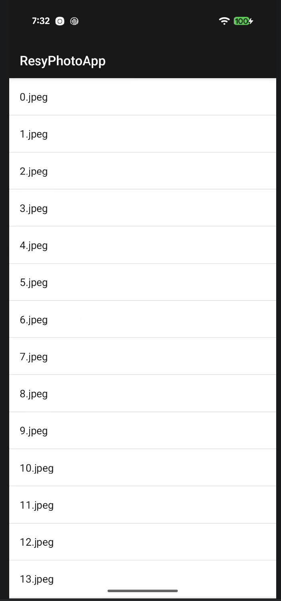
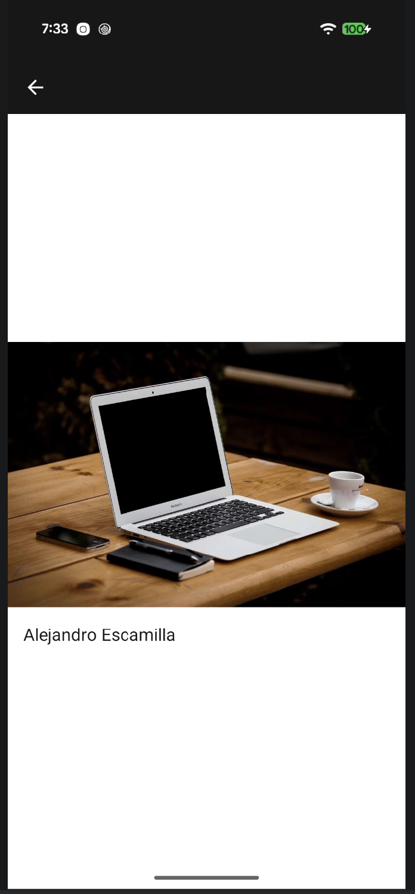
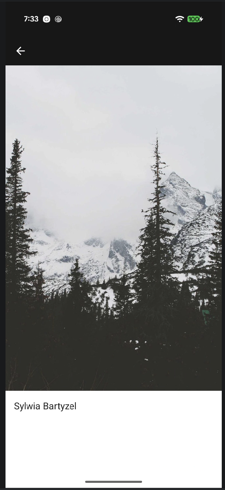

# Resy Photo App

I built this Android app as part of the Resy take-home assignment.

The app loads photo metadata from Lorem Picsum and displays the available image filenames in a list. Tapping a filename opens a detail screen where I display the selected image along with the author's name.

## Implementation

I kept the implementation intentionally simple and stayed within the assignment requirement of using no third-party libraries.

I used:

* Kotlin
* XML layouts
* RecyclerView
* ViewBinding
* `HttpURLConnection` for network requests
* `org.json` for parsing the API response
* `BitmapFactory` for loading images

The photo list is loaded from:

```text
https://picsum.photos/list
```

I converted the response into Kotlin `Photo` objects before displaying the filenames in the RecyclerView.

## Image display

For the detail screen, I followed the layout behavior described in the assignment.

For landscape images, I vertically centered the image and author together.

For portrait images, I positioned the image at the top of the available content area with the author's name directly underneath.

The image itself fills the available width while keeping its original aspect ratio, without cropping or distortion.

Images are requested using the assignment's endpoint format:

```text
https://picsum.photos/[width]/[height]?image=<id>
```

Rather than downloading very large source-resolution images, I useed the available screen width and calculate the requested height from the original dimensions returned by the API. This keeps the same aspect ratio while using a more appropriate image size for the device.

## Testing

The assignment asks for a unit test covering portrait vs. landscape behavior and one additional unit test.

I included tests for:

* Portrait vs. landscape image detection
* Picsum image URL generation

There are currently 4 passing unit test cases.

To run the tests:

```bash
./gradlew testDebugUnitTest
```

To build the app:

```bash
./gradlew assembleDebug
```

## Notes

I configured the app for phones in portrait orientation, as required by the assignment.

I also kept the UI fairly lightweight so the focus stays on the requested behavior and Android implementation rather than adding features outside the scope of the exercise.


I have tested this on a Google Pixel 9 Running Android 17 QPR2 Beta2. 
Below are the screenshots 

## Screenshots

<p align="center">
  
  
  
</p>
